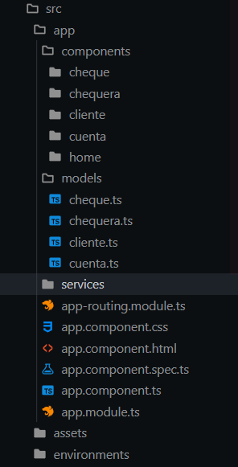
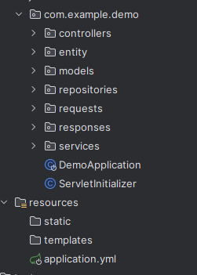
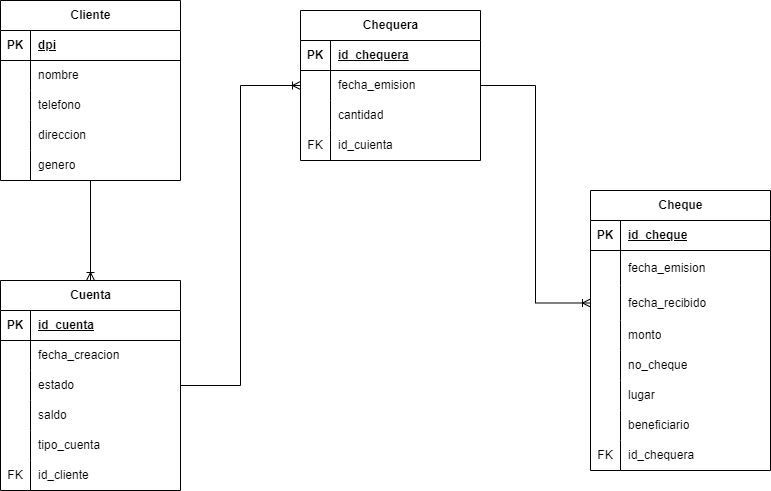

# Manual Técnico

--------

## Requisitos del sistema

- Java 11
- JDK 11
- Spring Boot 2.7.14
- Maven 4.0.0
- Node 18
- Angular CLI 19
- SQL Server 2019
- Docker
- Docker-compose

--------

## Tecnologías utilizadas

### Java Spring Boot
Se utilizó el framework de Java Spring Boot para el desarrollo del servidor. Spring Boot es un framework de Java que permite el desarrollo de aplicaciones web de manera rápida y sencilla. También, cuenta con una gran comunidad de desarrolladores que permite resolver problemas de manera rápida y eficiente. 

Además, se utilizó el framework de Spring Data JPA para el manejo de la base de datos. Spring Data JPA es un framework que permite el mapeo de objetos de Java a tablas de una base de datos relacional. Con este se realizó la conexión a la base de datos y el manejo de las consultas.

### Angular
Se utilizó el framework de Angular para el desarrollo del cliente. Angular es un framework de JavaScript que permite el desarrollo de aplicaciones web de manera rápida y sencilla. También, cuenta con una gran comunidad de desarrolladores que permite resolver problemas de manera rápida y eficiente.

Además, se utilizó boostrap para el diseño de la interfaz gráfica. Bootstrap es un framework de CSS que permite el diseño de interfaces gráficas de manera rápida y sencilla. También, cuenta con una gran comunidad de desarrolladores que permite resolver problemas de manera rápida y eficiente.

### Docker
Se utilizó Docker para el despliegue del sistema. Docker es una plataforma de software que permite la creación, el despliegue y la ejecución de aplicaciones en contenedores. Los contenedores permiten empaquetar una aplicación con todas sus dependencias en un contenedor virtual que puede ser ejecutado en cualquier sistema operativo.

### Docker-compose
Se utilizó Docker-compose para el despliegue del sistema. Docker-compose es una herramienta que permite la definición y ejecución de aplicaciones Docker de múltiples contenedores. Con esta herramienta se puede definir la configuración de los contenedores en un archivo YAML y ejecutarlos con un solo comando.

--------

## Arquitectura del sistema

### Cliente Servidor
El sistema cuenta con una arquitectura cliente servidor. Esta arquitectura se caracteriza por tener un cliente que realiza peticiones a un servidor y este le responde con los datos solicitados. En este caso, el cliente es una aplicación web desarrollada con Angular y el servidor es una aplicación web desarrollada con Java Spring Boot.

Además, el sistema cuenta con una base de datos relacional SQL Server. Esta base de datos se encuentra en un contenedor de Docker y es accedida por el servidor por medio de Spring Data JPA.

--------

## Despliegue del sistema

### Despliegue en la nube
Para el despliegue en la nube se realizó la configuración de una máquina virtual de Google Cloud. Esta máquina virtual cuenta con un sistema operativo Ubuntu 20.04 LTS y tiene instalado Docker y Docker-compose. Además, se realizó la configuración de reglas de firewall acceder al sistema por medio de una dirección URL.

Además, se hizo uso de Docker Hub para el almacenamiento de las imágenes de los contenedores. Docker Hub es un repositorio de imágenes de Docker que permite el almacenamiento de imágenes de manera pública o privada. En este caso, se utilizó para descargar las imágenes de los contenedores en la máquina virtual, tanto del cliente como del servidor.

### Despliegue local
Para el despliegue local se realizó la configuración de un archivo docker-compose.yml. Este archivo contiene la configuración de los contenedores del cliente, servidor. Además, se realizó la configuración de un archivo Dockerfile para la creación de la imagen del servidor. Este archivo contiene la configuración de la imagen del servidor y la descarga de las dependencias necesarias para su ejecución.

También se cuenta con el código fuente del cliente y del servidor. Para el cliente se cuenta con el código fuente de Angular y para el servidor se cuenta con el código fuente de Java Spring Boot. Para que ambos puedan ser ejecutados localmente se debe realizar la instalación de las dependencias necesarias.

--------

## Estructura del proyecto

### Estructura del cliente

El cliente cuenta con 4 componentes, los cuales son: clientes, cuentas, chequeras y cheques. Por cada componente se tiene un modelo que se utiliza para el manejo de los datos. Además, se cuenta con un servicio que se utiliza para realizar las peticiones al servidor. Por último, se cuenta con un módulo que se utiliza para la configuración de las rutas de la aplicación. Para la gestión de las rutas se utilizó el módulo de Angular Router, mientras que las peticiones al servidor se realizaron por medio del módulo de Angular HttpClient.

### Estructura del servidor

El flujo del backend cuenta con 7 capas, las cuales son: controlador, servicio, repositorio, modelo, entidad, request y response. La capa del controlador se encarga de recibir las peticiones del cliente y enviarlas a la capa del servicio. La capa del servicio se encarga de procesar las peticiones y enviarlas a la capa del repositorio. La capa del repositorio se encarga de realizar las consultas a la base de datos y enviarlas a la capa del servicio. Además, se cuenta con una capa de modelo que se utiliza para el manejo de los datos y con una capa de entidad que se utiliza para el mapeo de los datos de la base de datos. La capa de request y response se utilizand como mapeo de los datos que se envían y reciben del cliente, de esta manera se pueden manejar de mejor manera los parametros de las peticiones y las respuestas a las mismas.

También, se cuenta con un archivo de configuración de la base de datos. Este archivo contiene la configuración de la base de datos y la conexión a la misma. Para la conexión a la base de datos se utilizó el módulo de Spring Data JPA. Se configuraron CORS para permitir el intercambio de recursos entre el cliente y el servidor. Se cuetna con un dockerfile para la creación de la imagen del servidor. Este archivo contiene la configuración de la imagen del servidor y la descarga de las dependencias necesarias para su ejecución.

### Estructura de la base de datos

La base de datos cuenta con 4 tablas, las cuales son: clientes, cuentas, chequeras y cheques. La tabla de clientes cuenta con los datos de los clientes registrados en el sistema. La tabla de cuentas cuenta con los datos de las cuentas registradas en el sistema. La tabla de chequera cuenta con los datos de las chequeras registradas en el sistema. La tabla de cheques cuenta con los datos de los cheques registrados en el sistema.

Esta Entidad Relación se estructuró de esta manera debido a que se concluyó que un cliente puede tener una o varias cuentas. A su vez una cuenta puede tener una o varias chequeras. Por último, una chequera puede tener uno o varios cheques. Por lo tanto todas las relaciones son de uno a muchos.

