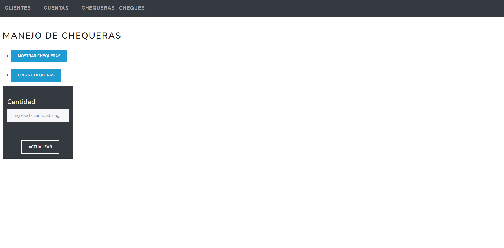

# Manual de usuario

---------

## Acceso al sistema
El sistema se encuentra alojado en la sigueinte dirección: [http://34.125.83.182](http://34.125.83.182). Pero también se puede levantar la aplicación locamente por medio de docker-compose. Para ello se requieren los siguientes puentos:

- Tener instalador [Docker](https://docs.docker.com/engine/install/)

- Tener instalado [Docker-compose](https://docs.docker.com/compose/install/).

- Tener instalado [Git](https://git-scm.com/book/en/v2/Getting-Started-Installing-Git).

Una vez verificadas las condiciones anteriores, se de clonar el repositorio con el siguiente comando:

```bash 
git clone https://github.com/GermanJosePazCordon/Angular_Sping_Sever_Crud.git
```
Luego acceder a la carpeta app y ejecutar el siguiente comando:

```bash
docker-compose up -d
```
Una vez ejecutado el comando anterior, se puede acceder al sistema por medio de la siguiente dirección: [http://localhost:4200](http://localhost:4200).

Por último, se puede ejecutar la aplicación localmente por medio del la instalación de dependencias tanto del cliente como del servidor.

--------

## Uso de la aplicación


La aplicación cuenta con cuatro funcionalidades distantas, las cuales puede ser accedir por medio de los botones del menú superior.

### Clientes


Esta función cuenta con un listado de todos los clientes registrados en el sistema. Además permite las acciones de modificar y eliminar un cliente. Para agregar un nuevo cliente se debe presionar el botón "Crear Cliente" y se abrirá un formulario para ingresar los datos del cliente. 


Una vez ingresados los datos del cliente, se debe presionar el botón "Añadir" para que se guarde el cliente en el sistema. Tomar encuenta que el campo "DPI" es único, no se puede repetir y debe constar de 13 dígitos. 


Para modificar un cliente se debe presionar el botón con de modificar y se abrirá un formulario con los datos del cliente. Una vez modificados los datos se debe presionar el botón "Actualizar" para que se guarden los cambios en el sistema.


Para eliminar un cliente basta con utlizar el botón con forma de X y este se eliminará del sistema.


-------

### Cuentas


Esta función cuenta con un listado de todas las cuentas registradas en el sistema. Además permite las acciones de agregar saldo y eliminar una cuenta. Para agregar una nueva cuenta se debe presionar el botón "Crear Cuenta" y se abrirá un formulario para ingresar los datos de la cuenta.


Una vez ingresados los datos de la cuenta, se debe presionar el botón "Añadir" para que se guarde la cuenta en el sistema. Tomar encuenta que el campo DPI debe pertenecer a un cliente previamente registrado en el sistema.


Para agregar saldo a una cuenta se debe presionar el botón de agregar saldo y se abrirá un formulario para ingresar el monto a agregar.


Para eliminar una cuenta basta con utlizar el botón con forma de X y este se eliminará del sistema.

-------

### Chequeras


Esta función cuenta con un listado de todas las chequeras registradas en el sistema. Además permite las acciones de agregar cheques y eliminar una chequera. Para agregar una nueva chequera se debe presionar el botón "Crear Chequera" y se abrirá un formulario para ingresar los datos de la chequera.


Una vez ingresados los datos de la chequera, se debe presionar el botón "Añadir" para que se guarde la chequera en el sistema. Tomar encuenta que el campo de ID debe pertenecer a una cuenta previamente registrada en el sistema.


Para agregar cheques a una chequera se debe presionar el botón de agregar cheques y se abrirá un formulario para ingresar el número de cheques a agregar.


Para eliminar una chequera basta con utlizar el botón con forma de X y este se eliminará del sistema.

------

### Cheques


Esta función cuenta con un listado de todos los cheques registrados en el sistema. Además permite las acciones de usar, modificar y eliminar un cheque. Para agregar un nuevo cheque se debe presionar el botón "Crear Cheque" y se abrirá un formulario para ingresar los datos del cheque.


Una vez ingresados los datos del cheque, se debe presionar el botón "Añadir Cheque" para que se guarde el cheque en el sistema. Tomar encuenta que el campo de ID debe pertenecer a una chequera previamente registrada en el sistema.


Para usar un cheque se debe presionar el botón de usar cheque y este se marcará como usado. Si el monto del cheque supera al saldo de la cuenta, este no podrá utilizarse.


Para modificar un cheque se debe presionar el botón con de modificar y se abrirá un formulario con los datos del cheque. Una vez modificados los datos se debe presionar el botón "Actualizar" para que se guarden los cambios en el sistema.


Para eliminar un cheque basta con utlizar el botón con forma de X y este se eliminará del sistema.